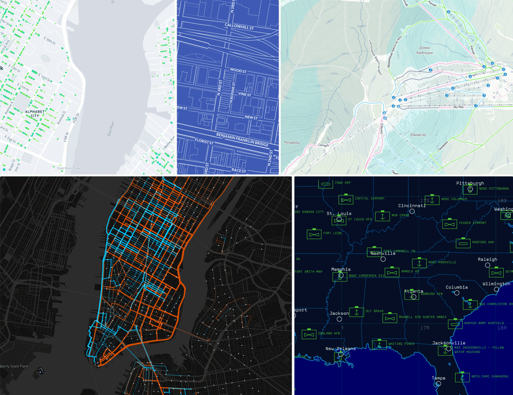

## Fork Versions:

Fork Version | Mapbox version | Notes
------------ | -------------- | ------
0.0.1        | 0.42.2         |
0.0.2        | 0.42.2         |
0.0.3        | 0.42.2         | Converting aggregateBy properties from string to number. Otherwise, not able to use exponential/interval stops.
0.0.4        | 0.42.2         | Support for multple aggregate by. Useful for aggregating by count and resizeBy column. Points (along with clusters which already have) will have abbreviated value for all aggregateBys.
0.0.5        | 0.42.2         | Added support for groupBy, for vecotTile(geojson). In each cluster it will have splitups of aggregate based on the groupBy values in the features contributing to the cluster.
0.0.6        | 0.42.2         | Added support for finding features contributing to a cluster, so that we can spiderfy.
0.0.7        | 0.44.0         | Upgraded fork to mapbox 0.44.0
0.0.8        | 0.44.0         | Moved all dependencies to devDependancies in package.json, as we use the prebuilt js and don't need to have mapbox-gl-js's dependancies installed to use it.

## Fork Modifications:
 * **Get Pins in Cluster**: Expose getLeaves in superCluster via an interface, so that we can get the pins in a cluster and spiderfy them. Same has been added for vectortile source with geojson endpoints and clustering
 * **Aggregate Cluster By**: Allow clusters to aggregated using a field. If a field is specified, each cluster will have a sum value which will be the sum of field values (pin[field]) of all pins in the cluster. Super cluster has built in support for it. But mapbox interface has not exposed it.
 * **Geojson tiles**: Provide geojson endpoints for VectorTileSource. Every fetched geojson will converted to vector tiles and handed back to the original workflow.

## Fork Examples:
  * fork_examples/geojsonTileClusters.html
  * fork_examples/geojsonTilePolygons.html

## Known Fork shortcomings:
  * Geojson tiles, always set the cache expiry time to 'undefined' and cache control to 'max-age=90000',
  ignoring the cache headers in the tile's response.
  * AggregateBy multiple values/group have been implemente only in VectorTileSource(with geojson data urls)
  but in not GeojsonSource.

**Mapbox GL JS** is a JavaScript library for interactive, customizable vector maps on the web. It takes map styles that conform to the
[Mapbox Style Specification](https://www.mapbox.com/mapbox-gl-js/style-spec), applies them to vector tiles that
conform to the [Mapbox Vector Tile Specification](https://github.com/mapbox/vector-tile-spec), and renders them using
WebGL.

Mapbox GL JS is part of the [cross-platform Mapbox GL ecosystem](https://www.mapbox.com/maps/), which also includes
compatible native SDKs for applications on [Android](https://www.mapbox.com/android-sdk/),
[iOS](https://www.mapbox.com/ios-sdk/), [macOS](http://mapbox.github.io/mapbox-gl-native/macos),
[Qt](https://github.com/mapbox/mapbox-gl-native/tree/master/platform/qt), and [React Native](https://github.com/mapbox/react-native-mapbox-gl/). Mapbox provides building blocks to add location features like maps, search, and navigation into any experience you
create. To get started with GL JS or any of our other building blocks,
[sign up for a Mapbox account](https://www.mapbox.com/signup/).

In addition to GL JS, this repository contains code, issues, and test fixtures that are common to both GL JS and the
native SDKs. For code and issues specific to the native SDKs, see the
[mapbox/mapbox-gl-native](https://github.com/mapbox/mapbox-gl-native/) repository.

- [Getting started with Mapbox GL JS](https://www.mapbox.com/mapbox-gl-js/api/)
- [Tutorials](https://www.mapbox.com/help/tutorials/#web-apps)
- [API documentation](https://www.mapbox.com/mapbox-gl-js/api/)
- [Examples](https://www.mapbox.com/mapbox-gl-js/examples/)
- [Style documentation](https://www.mapbox.com/mapbox-gl-js/style-spec/)
- [Open source styles](https://github.com/mapbox/mapbox-gl-styles)
- [Roadmap](https://www.mapbox.com/mapbox-gl-js/roadmap/)
- [Contributor documentation](https://github.com/mapbox/mapbox-gl-js/blob/master/CONTRIBUTING.md)

## License

Mapbox GL JS is licensed under the [3-Clause BSD license](https://github.com/mapbox/mapbox-gl-js/blob/master/LICENSE.txt).
The licenses of its dependencies are tracked via [FOSSA](https://app.fossa.io/projects/git%2Bhttps%3A%2F%2Fgithub.com%2Fmapbox%2Fmapbox-gl-js):

