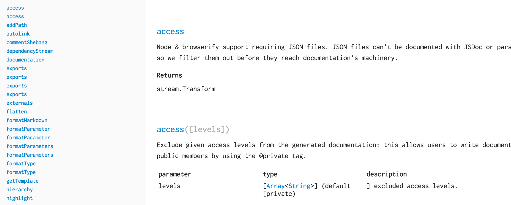

# documentation-theme-default

This is the default theme for [documentationjs](https://github.com/documentationjs):
it consists of Handlebars templates and a few assets: a [highlight.js](https://highlightjs.org/)
theme and [basscss](http://www.basscss.com/) as a basic CSS framework.

This is bundled by default in documentation: it is the default theme.

The contents are the following:

* `index.hbs`, the main template that defines the document structure
* `section.hbs`, a partial used to render each chunk of documentation
* `assets/*`, any assets, including CSS & JS

# Helpers

* `{{format_params}}`: format function parameters, including the types
  included within.
* `{{permalink}}`: in the context of a documentation chunk,
  return the chunk's permalink
* `{{autolink TEXT}}`: given a chunk of text that may be a reference to a
  method, property, or other namespaced item, link the text to the item
* `{{md TEXT}}`: render Markdown-formatted text, parsing additional
  JSDoc inline tag syntax and linking links when necessary
* `{{format_type}}`: format a type definition, like `{string}` within a
  param definition.
